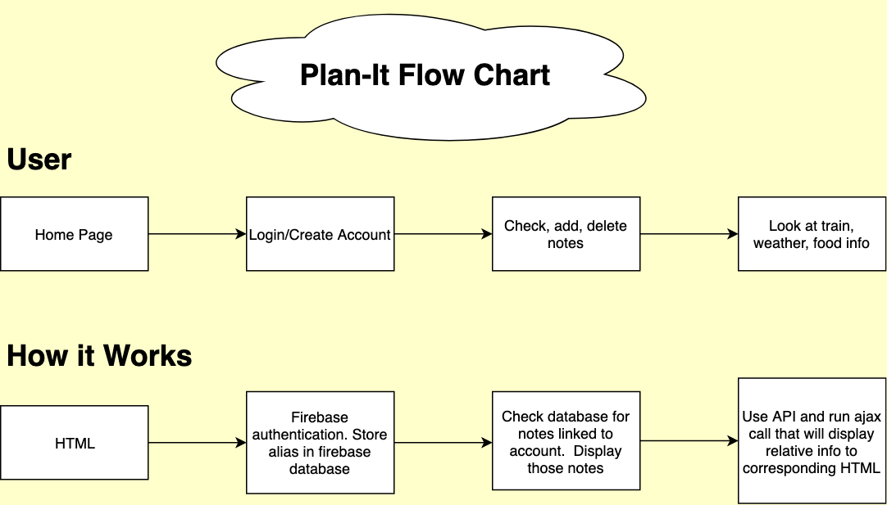

# Group Project (Plan It)
We created a planner application that allows you to take notes, check bart information, weather data, and food places near a certain location
## Link to deployed site
https://esarnb.github.io/Plan-It/

## Images

## Technologies used
<!-- make a list of technology used -->
<!-- what you used for this web app, like html css -->
1. [HTML5](https://www.w3schools.com/html/html_intro.asp)
2. [Bootstrap](https://getbootstrap.com/docs/4.3/getting-started/introduction/)
    * grid layout
3. [jQuery](https://www.w3schools.com/jquery/jquery_intro.asp)
    * Event handling
    * Dynamically create new elements
    * Appending and removing newly created elements to other html elements
    * Providing attributes to the newly dynamically created elements
4. [AJAX API Calls](http://api.jquery.com/jquery.ajax/)
    * Building querystrings for the AJAX call to APIs
    * Utilizing the response received from the API
5. [Firebase](https://hackernoon.com/introduction-to-firebase-218a23186cd7)
    * Keeping data persistent
    * Configuring and initializing firebase 
    * Event handlers(child_added, value)
    * Saving and retreiving data from the application to the database
6. [Github](https://github.com/)
    * version control working with collaborators
    * Branching from master branch
    * Merging back to master branch
## How it works

## APIs used
1. Open weather map Api
    * Includes current temperature, humidity, and hourly/daily forecast
https://openweathermap.org/api" + apiKey

2. Bart Api
    * Includes station info, train times, and train info
https://www.bart.gov/schedules/developers/api" + apiKey

3. Yelp Api
    * Includes restaurant name, a picture of the place, and the rating
https://www.yelp.com/developers/documentation/v3 + apiKey

4. Favqs Api
    * Fetches quotes from famous past figures per api call
https://favqs.com/api/qotd 

(API Responses are in JSON format)

----
### Firebase's Authorization and Realtime Database Example Codes
<!-- put snippets of code inside ``` ``` so it will look like code -->
<!-- if you want to put blockquotes use a > -->

#### Creating a new user in firebase-auth (auth) and passing in the custom user-id from auth to the realtime database:
```javascript
auth.createUserWithEmailAndPassword(email, pass).then(user => {
    database.ref("/users").child(auth.currentUser.uid).update({
        email: user.email,
        notes: ["Welcome to your notes!"],
        dateAdded: firebase.database.ServerValue.TIMESTAMP
    })
})
```
* We pass in the object we want to store for the new user as a first-time login

---

#### To sign a user in:
```javascript
auth.signInWithEmailAndPassword(email, pass).catch(err => console.log(err.message));
```
* We catch all errors and display them to the console, within the project we get the err.code
and display error messages within the sign-in modal 
(You may see it in the javascript file 'app.js' near the end of the file)

---
#### A listener to detect whenever a user signs in or logs out:
```javascript
auth.onAuthStateChanged(user => {
    if (user) {
        //User has logged into the website
        //auth.currentUser gets updated to the current user
    } else {
        //The user has logged out of the site
        //auth.currentUser is now undefined/null
    }
})
```
* This listener may be used to display information based on a specific user, however
we utilized it to update the sign-out button between login & logout.

---

#### JQuery AJAX call to an API: Yelp Example
```javascript
var queryURL = "https://api.yelp.com/v3/businesses/search?&location=" + foodInput
var heroku = 'https://cors-anywhere.herokuapp.com/'
// We then created an AJAX call
$.ajax({
    url: heroku + queryURL,
    headers: {
        'Authorization': 'Bearer ' + APIKey
    },
    method: "GET"
}).then(function (response) {
  //You may use response from the api to display information to the site,
  //dynamically using jquery
})
```
* The project uses several kinds of apis, where each uses an AJAX call to the api. 
Some sites (like Yelp) have an api restriction where CORS (Cross-Origin Resource Sharing) is necessary.

* So we use the Heroku app's cors-anywhere proxy alongside our query api call to run our query through Heroku,
in which they then relay to Yelp. Then the api returns data based on the query given, and passed into 'response'.

* The Yelp API requires their apikey in a header, unlike many other apis where they may ask for the key as part of the query.

----
  
## Learning points
<!-- Learning points where you would write what you thought was helpful -->
1. Working with Github with collaborators was a new learning experience
    * Branching and Merging with master branch
    * Communicating when changes made to master
2. Communicationg within group members
    * Updating members every day about the progress
## Authors
<!-- make a link to the deployed site and have your name as the link -->
* [Esar](https://github.com/esarnb)
* [Minal](https://github.com/minalk24)
* [Daniel](https://github.com/dchicchon)
* [Matt](https://github.com/matkuh)

